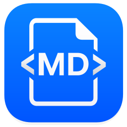

<p align="center">
  
</p>

<h1 align="center">MDviewer</h1>

<p align="center">
  Markdown previews are usually cluttered, browser-based, or tied to editors.<br>
  MDviewer is a tiny native macOS app that opens any Markdown file as a clean, print-ready document.
</p>

<p align="center">
  <a href="https://github.com/JackYoung27/mdviewer/releases/latest">Download</a>
  &nbsp;&middot;&nbsp;
  <a href="#features">Features</a>
  &nbsp;&middot;&nbsp;
  <a href="#install">Install</a>
</p>

---

<p align="center">
  
</p>

## Why MDviewer?

Most Markdown previews are inside editors or browsers.

MDviewer is different:
- Double-click a Markdown file and read it immediately
- Clean typography optimized for printing
- No Electron, no runtime dependencies
- Fully local and secure

## Features

- **Native macOS** — Cocoa + WKWebView, launches instantly, under 1 MB
- **Print-ready typography** — serif body, clean headings, proper spacing
- **PDF export** — `Cmd+Shift+E` to save, `Cmd+P` to print
- **Live reload** — re-renders automatically when the file changes on disk
- **GitHub Flavored Markdown** — tables, task lists, fenced code blocks
- **Dark mode** — follows your macOS appearance setting
- **Secure** — HTML sanitized with [DOMPurify](https://github.com/cure53/DOMPurify), strict Content Security Policy
- **Finder integration** — registers as default `.md` handler; double-click to open
- **Tabbed windows** — multiple documents in one window
- **Local-first** — no network calls, no telemetry, no accounts

## Install

### Download

1. Grab `MDviewer.app.zip` from [Releases](https://github.com/JackYoung27/mdviewer/releases/latest)
2. Unzip, drag to `/Applications`
3. First launch: right-click → **Open** (required once for unsigned apps)

### Build from source

```bash
git clone https://github.com/JackYoung27/mdviewer.git
cd mdviewer
./build.sh          # builds to dist/Markdown Viewer.app
./install.sh        # optional: copies to /Applications and sets as default handler
```

Requires Xcode Command Line Tools (`xcode-select --install`).

## Keyboard Shortcuts

| Action | Shortcut |
|---|---|
| Open file | `Cmd+O` |
| Reload | `Cmd+R` |
| Print | `Cmd+P` |
| Export PDF | `Cmd+Shift+E` |
| Close window | `Cmd+W` |

## Screenshots

| Document view | Code blocks | Checklists |
|---|---|---|
|  |  |  |

## License

[MIT](./LICENSE)
